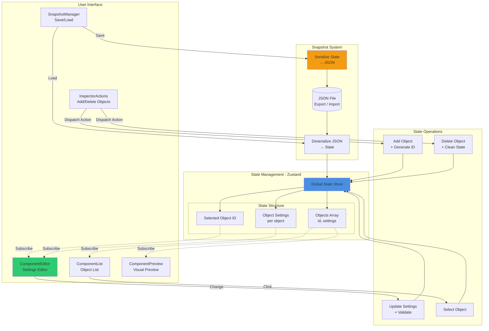

# React 기반 오브젝트 상태 관리 및 복원 포트폴리오

## 🔗 이 프로젝트의 위치

> **이 프로젝트는 [Event-driven Real-time Game Platform](https://github.com/1985jwlee/portpolio_main)의 Admin Dashboard 선행 검증 프로토타입입니다.**

### 메인 포트폴리오와의 관계
```
[ Main: 게임 서버 설계 ]
    ↓
    실시간 오브젝트 상태 관리
    Event-driven Architecture
    Server-authoritative 구조
    ↓
[ React: Admin Dashboard 구현 검증 ]
    ↓
    UI 기반 오브젝트 관리
    상태 저장/복원 메커니즘
    운영 도구 프로토타입
```

### 이 프로토타입을 먼저 만든 이유

메인 포트폴리오에서 **Admin Dashboard를 설계**할 때, 한 가지 가정이 생겼다.

> "서버 오브젝트의 상태를 추가·삭제·저장·복원하는 운영 도구를,  
> 실제로 동작하는 UI로 구현할 수 있는가?"

서버 설계를 먼저 문서화하고 구현을 뒤로 미루는 방식은,  
**"설계만 알고 구현은 못하는 것 아닌가"** 라는 의심을 남긴다.

그래서 메인 포트폴리오의 핵심 개념을 UI 레벨로 축소해 **실제 동작하는 형태로 먼저 증명**했다.

### 이 경험이 메인 포트폴리오로 이어진 것들

- 서버의 In-memory 상태 관리를 UI로 옮기면 **Zustand Single Source of Truth 구조**와 동일한 문제임을 확인했다
- Redis Hot Snapshot / MongoDB Cold Snapshot의 저장·복원 메커니즘이  
  **메모리 스냅샷 / JSON Export-Import**로 그대로 대응됨을 구현으로 증명했다
- "UI는 상태의 결과물"이라는 판단이 **서버 상태 설계 사고방식과 완전히 일치**함을 확인했다

### 검증하는 능력

| Main Portfolio | React Portfolio |
|----------------|-----------------|
| Game Server State (In-memory) | UI State (Zustand Store) |
| Event Sourcing | State Change → Re-render (단방향 흐름) |
| Redis Hot Snapshot | 메모리 스냅샷 (이름 붙여 저장·전환) |
| MongoDB Cold Snapshot | JSON Export / Import |
| 운영 대시보드 **설계** | 운영 도구 **구현 · 동작 검증** |

### 핵심 메시지

> "프론트엔드 전문가가 되려는 것이 아니라,  
> 설계한 시스템의 운영 도구를 직접 구현할 수 있는 능력 검증"

---

## 📋 목차

1. [프로젝트 개요](#1-프로젝트-개요)
2. [프로젝트 목적](#2-프로젝트-목적)
3. [기술 스택](#3-기술-스택)
4. [애플리케이션 구조 개요](#4-애플리케이션-구조-개요)
5. [핵심 구현 내용](#5-핵심-구현-내용)
6. [설계 관점에서의 핵심 판단](#6-설계-관점에서의-핵심-판단)
7. [의도적으로 하지 않은 것들](#7-의도적으로-하지-않은-것들)
8. [실행 방법](#8-실행-방법)
9. [한 줄 요약](#9-한-줄-요약)

---

## 1. 프로젝트 개요

본 프로젝트는 **React를 이용해 동적 오브젝트(Object)의 생성·삭제·설정 변경과 상태 저장/복원을 구현한 UI 실험 포트폴리오**이다.  
사용자는 화면 상에서 오브젝트를 추가하고 제거하며, 각 오브젝트의 설정값을 변경한 뒤  
해당 상태를 저장하고 다시 불러와 **동일한 상태의 화면을 복원**할 수 있다.

이 프로젝트의 목적은 UI 구현 자체가 아니라,

- 오브젝트 단위 상태 모델링
- 단일 상태 원천(Single Source of Truth)
- 상태 변경 → UI 재구성의 단방향 흐름
- 저장 가능한 형태의 상태 직렬화
- 복원 시 UI와 데이터 상태의 일관성 유지

를 **React 애플리케이션 구조 안에서 명확하게 보여주는 것**이다.

---

## 2. 프로젝트 목적

- React를 활용한 **동적 오브젝트 관리 UI 구성**
- 오브젝트별 설정값을 상태로 모델링하는 구조 설계
- 현재 상태를 저장 가능한 데이터(JSON) 형태로 변환
- 저장된 상태를 다시 불러와 **동일한 UI 상태로 복원**

본 프로젝트는 시각적 완성도나 복잡한 UX를 목표로 하지 않는다.  
**"UI를 하나의 상태 기반 시스템으로 다루는 사고 방식"**을 검증하기 위한 범위로 의도적으로 제한하였다.

---

## 3. 기술 스택

- **React 19**
- **TypeScript**
- **Zustand** (상태 관리)
- **Vite**
- **Tailwind CSS**

> Redux 등 대규모 상태 관리 도구는 사용하지 않았다.  
> 상태 규모와 문제의 크기에 맞춰 **가볍고 명확한 상태 관리 방식**을 선택했다.

---

## 4. 애플리케이션 구조 개요

본 프로젝트는 Inspector / Editor 패턴을 기반으로 구성되어 있다.

```
App
 ├─ InspectorActions        // 상태 저장/불러오기
 ├─ ComponentList           // 컴포넌트 목록 & 추가/삭제
 ├─ ComponentEditor         // 선택된 컴포넌트 설정값 편집
 ├─ ComponentPreview        // 현재 상태 시각화
 └─ SnapshotManager         // 스냅샷 관리
```

모든 상태는 전역 상태 스토어(Zustand)에 집중되어 있으며,  
각 컴포넌트는 상태를 직접 소유하지 않고 **표현과 입력 역할만 담당**한다.

## 📐 State Management Architecture



### 상태 흐름

- **Action** → **Store** → **View** (단방향)
- **Snapshot**: State ↔ JSON 직렬화
- **Subscribe**: 상태 변경 시 자동 렌더링


---

## 5. 핵심 구현 내용

### 5.1 컴포넌트 추가 / 삭제

- 사용자 액션에 따라 컴포넌트를 동적으로 생성 및 제거
- 각 컴포넌트는 고유 ID와 필드값을 보유
- 삭제 시 상태 불일치나 잔존 데이터가 발생하지 않도록 설계

<details>
<summary><b>구현 코드 보기</b></summary>
    
```typescript
// stores/inspectorStore.ts
addComponent: (type, fields) =>
  set((state) => ({
    gameObject: {
      ...state.gameObject,
      components: [
        ...state.gameObject.components,
        { id: uuidv4(), type, fields },
      ],
    },
  })),

removeComponent: (id) =>
  set((state) => ({
    gameObject: {
      ...state.gameObject,
      components: state.gameObject.components.filter((c) => c.id !== id),
    },
  })),
```

</details>

---

### 5.2 오브젝트 설정값 관리

- 선택된 컴포넌트의 필드값을 Editor UI에서 수정
- 설정 변경은 즉시 전역 상태에 반영
- UI는 항상 상태의 결과로만 렌더링됨

<details>
<summary><b>구현 코드 보기</b></summary>
    
```typescript
updateField: (componentId, fieldName, newValue) =>
  set((state) => ({
    gameObject: {
      ...state.gameObject,
      components: state.gameObject.components.map((c) =>
        c.id === componentId
          ? {
              ...c,
              fields: c.fields.map((f) =>
                f.name === fieldName ? { ...f, value: newValue } : f
              ),
            }
          : c
      ),
    },
  })),
```

</details>

---

### 5.3 상태 저장 (JSON Export)

- 현재 모든 컴포넌트 상태를 하나의 구조로 정리
- JSON 직렬화가 가능한 형태로 저장
- UI 상태가 아닌 **순수 데이터 상태만 저장**

> 이 구조는 메인 포트폴리오의 **MongoDB Cold Snapshot**에 대응한다.

<details>
<summary><b>구현 코드 보기</b></summary>
```typescript
const handleSave = () => {
  const json = JSON.stringify(gameObject, null, 2)
  const blob = new Blob([json], { type: 'application/json' })
  const url = URL.createObjectURL(blob)
  const a = document.createElement('a')
  a.href = url
  a.download = 'gameObject.json'
  a.click()
  URL.revokeObjectURL(url)
}
```

</details>

---

### 5.4 상태 불러오기 및 복원

- 저장된 데이터를 다시 상태 스토어에 주입
- 컴포넌트 목록, 필드값, 선택 상태가 모두 동일하게 복원
- 데이터 상태와 UI 상태의 불일치가 발생하지 않도록 구성

> 이 구조는 백엔드 시스템에서의 **스냅샷 복구 개념을 UI 상태 관리로 축소 적용한 예제**에 해당한다.

<details>
<summary><b>구현 코드 보기</b></summary>
```typescript
const handleLoad = (e: React.ChangeEvent<HTMLInputElement>) => {
  const file = e.target.files?.[0]
  if (!file) return
  const reader = new FileReader()
  reader.onload = (event) => {
    try {
      const parsed = JSON.parse(event.target?.result as string)
      setGameObject(parsed)
    } catch (err) {
      alert('잘못된 JSON 형식입니다.')
    }
  }
  reader.readAsText(file)
}
```

</details>

---

### 5.5 스냅샷 관리

- 여러 상태를 이름을 붙여 저장
- 저장된 스냅샷 목록에서 선택하여 즉시 복원

> 메인 포트폴리오의 **Redis Hot Snapshot** 개념을 UI 레벨로 구현한 예제다.  
> 복구 우선순위(Hot → Cold) 로직도 동일한 사고방식으로 설계되었다.

<details>
<summary><b>구현 코드 보기</b></summary>
    
```typescript
const saveSnapshot = () => {
  if (!snapshotName.trim()) return
  setSnapshots([...snapshots, {
    name: snapshotName.trim(),
    data: gameObject
  }])
  setSnapshotName('')
}

const loadSnapshot = (data: any) => {
  setGameObject(data)
}
```

</details>

---

## 6. 설계 관점에서의 핵심 판단

- **UI는 상태의 결과물이다**
- **컴포넌트 추가/삭제는 이벤트이며, 상태 변경으로만 표현한다**
- **모든 상태는 단일 원천에서 관리한다**
- **저장과 복원은 데이터 문제이지 UI 문제가 아니다**

이 프로젝트는 React를 화면 기술로 다루기보다는,  
**상태 기반 시스템을 표현하는 도구로 사용한 사례**이다.

### 메인 포트폴리오 개념과의 대응

| 메인 포트폴리오 | React 포트폴리오 |
|----------------|-----------------|
| Game Server State | UI State (Zustand) |
| Redis Hot Snapshot | 스냅샷 관리 (메모리) |
| MongoDB Cold Snapshot | JSON Export/Import |
| Event Sourcing | State Change Log |
| Admin Dashboard 설계 | 실제 UI 구현 |

---

## 7. 의도적으로 하지 않은 것들

- 복잡한 애니메이션 및 시각 효과 ❌
- 과도한 UI 프레임워크 도입 ❌
- 프론트엔드 단독 아키텍처 과시 ❌

본 프로젝트는 프론트엔드 전문성을 증명하기 위한 것이 아니라,  
**상태 모델링과 복원 문제를 UI 레벨에서 다룰 수 있음을 보여주는 보조 포트폴리오**다.

---

## 8. 실행 방법

```bash
npm install
npm run dev
```

브라우저에서 `http://localhost:5173` 접속

### 사용 흐름

1. **컴포넌트 추가**: 왼쪽 패널에서 "Add Component" 버튼 클릭
2. **필드 편집**: 가운데 패널에서 선택된 컴포넌트의 필드값 수정
3. **상태 확인**: 오른쪽 패널에서 현재 JSON 구조 확인
4. **저장**: "💾 저장" 버튼으로 JSON 파일로 내보내기
5. **불러오기**: "📥 불러오기"로 저장된 JSON 파일 복원
6. **스냅샷**: 이름을 붙여 여러 상태를 저장하고 전환

---

## 9. 한 줄 요약

> 이 프로젝트는 React로 만든 화면 예제가 아니라,  
> **오브젝트 상태를 추가·삭제·저장·복원하는 작은 상태 기반 시스템**이다.

---

## 🔄 다음 단계

### 실제 적용 예정

이 프로토타입을 기반으로 [메인 포트폴리오](https://github.com/1985jwlee/portpolio_main)의 Admin Dashboard를 구현할 예정입니다:

- [ ] 실시간 게임 서버 모니터링 UI
- [ ] Zone별 플레이어 상태 조회
- [ ] Event Stream 시각화
- [ ] 장애 대응 인터페이스
- [ ] Snapshot 관리 도구

---

## 📧 Contact

**Main Portfolio**: [Event-driven Game Platform](https://github.com/1985jwlee/portpolio_main)  
**Overview**: [Portfolio Overview](https://github.com/1985jwlee)

---

**Last Updated**: 2025-01-15
